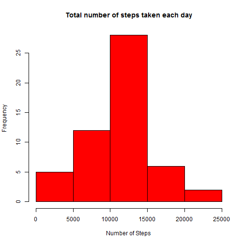

# Peer Assignement 1

## Load the data

```r
rawdata <- read.csv("activity.csv", head=TRUE, na.strings="NA")
```

## Transform date variable to date format

```r
rawdata$date <- as.Date(rawdata$date)
```

## Delete observations with missing value of steps

```r
df <- subset(rawdata, !is.na(rawdata$steps))
```

## Calculate the total number of stpes taken per day

```r
dailytotal <- tapply(df$steps, df$date, sum)
```

## Make a histogram of the total number of steps taken each day

```r
hist(x=dailytotal, xlab="Number of Steps", ylab="Frequency",
     col="red", main="Total number of steps taken each day")
```

 

## Mean of the total number of steps taken each day

```r
mean(dailytotal)
```

```
## [1] 10766.19
```

## Median of the total number of steps taken each day

```r
median(dailytotal)
```

```
## [1] 10765
```

## Plot of the 5-minute interval (x-axis) and the average number of steps taken, averaged across all days (y-axis)

```r
stepsInterval <- aggregate(steps~interval, df, mean)
plot(stepsInterval$interval, stepsInterval$steps, type="l",
     xlab="5-minute Interval", ylab="Average steps across all days",
     main="Average Number of Steps Each Day by Interval")
```

 

## Maximum number of steps

```r
maxStep <- stepsInterval[which.max(stepsInterval$steps),1]
maxStep
```

```
## [1] 835
```

## Total number of missing days/intervals

```r
sum(is.na(rawdata$steps))
```

```
## [1] 2304
```

## Impute misssing values with mean

```r
rawImpute <- rawdata
missing <- is.na(rawImpute$steps)
impute <- tapply(df$steps, df$interval, mean, na.rm=TRUE)
rawImpute$steps[missing] <- impute[as.character
                                   (rawImpute$interval[missing])]
```

## Histogram of the total number of steps taken each day with no missing

```r
dailytotalNomissing <- tapply(rawImpute$steps, rawImpute$date, sum)
hist(x=dailytotalNomissing, xlab="Number of Steps", ylab="Frequency",
     col="red",
     main="Total number of steps taken each day with missing imputed")
```

 

## Mean of the total number of steps taken each day with no missing

```r
mean(dailytotalNomissing)
```

```
## [1] 10766.19
```

## Median of the total number of steps taken each day with no missing

```r
median(dailytotalNomissing)
```

```
## [1] 10766.19
```


### Do these values differ from the estimates from the first part of the assignment?
### The median moved toward to the mean and became equal to the mean because the missings were imputed with the mean and there are more values equal to the mean.

### What is the impact of imputing missing data on the estimates of the total daily number of steps?
### There are more numbers because the missings were replaced with a value.  Higher counts are in the center region because there are more mean values in the data.

## Create new factor variables with two levels - weekday and weekend

```r
weekdata <- function(d) {
  weekday <- weekdays(d)
  ifelse (weekday == "Saturday" | weekday == "Sunday",
          "weekend", "weekday")
}

week <- sapply(rawImpute$date, weekdata)
rawImpute$week <- as.factor(week)
```

## Plot of the 5-minute interval (x-axis) and the average number of steps taken, averaged across all weekday days or weekend days (y-axis)

```r
stepsInterval_week <- aggregate(steps~week+interval, rawImpute, mean)
library(lattice)
xyplot(steps~interval | factor(week), layout = c(1,2), type="l",
     xlab="5-minute Interval",
     ylab="Average steps across all weekday/weekend days",
     stepsInterval_week)
```

 


```r
library(knitr)
setwd("C:/My Documents/Company Work/LA County/Reproducible Research")
knit2html("PA1_template.Rmd")
```

```
## 
## 
## processing file: PA1_template.Rmd
```

```
## Error in parse_block(g[-1], g[1], params.src): duplicate label 'load'
```

```r
browseURL("PA1_template.html")
```
